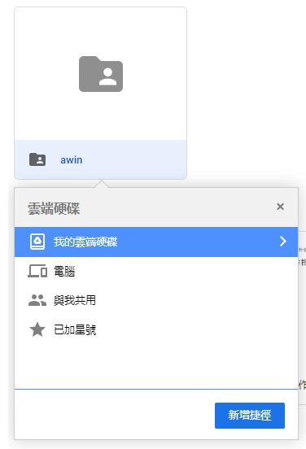

AWINLAB 新生作業
===

本專案使用 Google Colab 撰寫，因此建議在 Google Colab 上操作。若使用本地開啟，請將 ``from google.colab import drive``，以及 ``drive.mount('/content/drive')`` 這兩行程式碼註解，並修改相關路徑，且須自行下載[資料集](https://www.kaggle.com/datasets/alxmamaev/flowers-recognition)，並取名為 flower.zip 至 p1 資料夾。 

## Google Colab 操作步驟
1. 點選 [雲端網址](https://drive.google.com/drive/folders/1WU1v2zSsUUopsihLyKvmEux3eJtsh2ji?usp=sharing)
2. 前往「與我共用」，就會看到 awin 資料夾 
3. 滑鼠右鍵點擊該資料夾，選擇「新增雲端硬碟捷徑」 
    
      
4. 將捷徑設在「我的雲端硬碟」 
    
      
5. 就可以在不用修改任何路徑的情況下執行 Google Colab 了

## P1: 深度學習
深度學習的前置作業很多，從分割訓練集和測試集，到規劃 model 的深度和內容，對於從來沒有接觸過深度學習的我來說，其實面對這麼多的資料型態，一時之間還真的不知道該從哪邊開始處理，最後也只能達到近七成的辨識率。我在製作這道題目的時候，請教了擅長深度學習的朋友，他們在某些地方一時之間也沒辦法跟我解釋，為什麼這一個步驟要這麼做，這也讓我更加確信，要調配好一個模型絕對需要大量經驗的累績。

## P2: 超啟發式演算法
著手處理這道題目的時候，其實跟解其他演算法的題目很像，一開始寫的時候會有些卡手，但是只要抓到規律跟精隨，寫起來就會流暢許多，但不一樣的是，機率對於超啟發式演算法扮演了一個極為重要的角色，一般的演算法，同樣的資訊丟進去一定會是一樣的結果，然而超啟發式演算法在面對 0/1 背包這種 NP-complete 問題的時候，顯得靈活取多。